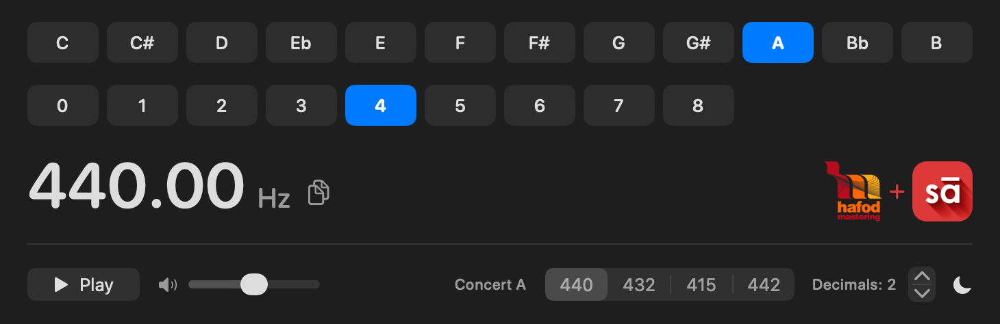

# SA-Sur


**SA-Sur : Note to Frequency**<br>Know your note. Know your frequency.

SA-Sur shows the frequency of any note in twelve-tone equal temperament and plays it as a sine tone. One window, macOS and Windows.



**Version 1.0.** Free, Apache-2.0, released by **Hafod Mastering** and **Sudeep Audio**.

## Install

**macOS 13.0 or later**, Apple Silicon and Intel. Download `SA-Sur-1.0-notarized.zip` from [Releases](../../releases), unzip it, drag `SA-Sur.app` to `/Applications`, and open it. The download is signed with a Developer ID and notarized by Apple, so macOS opens it with the ordinary "downloaded from the internet" confirmation and nothing else.

**Windows 10 or later, 64-bit.** Download `SA-Sur.exe` from [Releases](../../releases) and run it: it is self-contained, so there is nothing to install and no .NET runtime to add.

The Windows build is **not signed yet**, so SmartScreen shows *"Windows protected your PC"* with an unknown publisher — choose *More info → Run anyway*. Signing is in progress through [SignPath Foundation](https://signpath.org/); [docs/CODE-SIGNING.md](docs/CODE-SIGNING.md) records where that stands and what the signature will and will not prove.

The feature set matches the macOS app, and audio goes to the default Windows output device.

## Use

| Do this | What happens |
|---|---|
| Click a note | Selects it, displays the frequency |
| Click an octave | Retunes immediately, even while sounding |
| Play / Stop, or **Space** | Starts and stops the tone |
| Speaker slider | Output level |
| 440 / 432 / 415 / 442 | Concert-A reference; the whole readout follows |
| Copy icon | Copies the frequency exactly as displayed |
| Decimals stepper | 0–6 decimal places |
| Display icon | Toggles between light mode, dark mode and system mode |

The app opens at **A4, octave 4, 440 Hz → 440.00 Hz**, two decimal places. Notes run `C C# D Eb E F F# G G# A Bb B`; octaves run 0–8 (C0 = 16.35 Hz, B8 = 7902.13 Hz).

The tone is a phase-continuous sine with a 12 ms gain envelope, so starting, stopping and changing pitch are click-free. Output is capped at 0.11 full scale; the measurements behind that cap and the layout arithmetic are in [docs/DESIGN.md](docs/DESIGN.md).

## Build

**macOS** needs only the Xcode **Command Line Tools**: no Xcode, no project file, no package manager, no third-party dependencies.

```sh
./build.sh    # universal .app, .icns and zip, ad-hoc signed
./test.sh     # the maths and DSP checks, plus an independent diff of the note table
./verify.sh   # test.sh, then the audio graph rendered offline, then the UI render
```

**Windows** needs the .NET SDK 10:

```sh
cd windows
dotnet build SA-Sur.slnx -c Release
dotnet test  SA-Sur.slnx -c Release   # 80 tests
```

A macOS build from source is **not notarized**, so Gatekeeper will block it — it carries no Developer ID and no notarization ticket. To open your own build:

```sh
xattr -dr com.apple.quarantine /Applications/SA-Sur.app
```

Or try to open it, dismiss the dialog, then **System Settings → Privacy & Security → Open Anyway**. Nothing here needs `sudo`, and unzipping with `unzip` does not remove the quarantine flag.

A notarized build additionally needs a *Developer ID Application* certificate and stored notarization credentials. The header of `tools/notarize.sh` documents both.

```
src/NoteMath.swift         the formula, note names, formatting
src/SineOscillator.swift   pure DSP: phase, gain envelope (no AVFoundation)
src/ToneGenerator.swift    AVAudioEngine graph, play/stop/volume
src/Views.swift            SwiftUI layout
src/App.swift              app entry point
tests/main.swift           verification harness
tools/                     mark and icon composition, snapshot measurement, table diff
docs/DESIGN.md             why the app is the shape it is
docs/RELEASE.md            signing, notarizing and publishing a release
windows/                   the same app in C# + Avalonia (Core, Audio, Ui, App)
.github/workflows/windows.yml   builds, tests and packages the Windows app
```

`src/SineOscillator.swift` avoids AVFoundation deliberately, so the DSP can be rendered into a buffer and measured instead of only heard. The app was written with AI assistance and checked the hard way: offscreen renders, measurements read back from the shipped artifact, and Gatekeeper tested on a quarantined copy.

## Licence and marks

**Apache License 2.0** — see [LICENSE](LICENSE) and [NOTICE](NOTICE). Copyright © 2026 Hafod Mastering Ltd and Sudeep Audio. Use it, modify it, redistribute it, sell it, including inside closed-source products; keep the notices, and state significant changes. It is published free of charge: there is no paid edition or support contract.

The names, logos and marks of Hafod Mastering and Sudeep Audio, and the **SA-Sur** name and app artwork, are not licensed with the code (Apache-2.0 §6). Forks are welcome; forks presented as coming from, co-branded with, or endorsed by either company are not. If you ship a modified build, replace those marks or remove them.

## Code signing policy

Free code signing provided by [SignPath.io](https://about.signpath.io/), certificate by [SignPath Foundation](https://signpath.org/).

**macOS.** Releases are signed with an Apple *Developer ID Application* certificate issued to **Sudeep Audio.com LLP** and notarized by Apple, so Gatekeeper reports `accepted, source=Notarized Developer ID`. The steps are in [docs/RELEASE.md](docs/RELEASE.md).

**Windows.** Under application to SignPath Foundation — [docs/CODE-SIGNING.md](docs/CODE-SIGNING.md) records the state of it.

**Team roles**

- **Authors** — commit to the repository directly: [members of the organisation](https://github.com/orgs/hafodmastering/people) (Donal Whelan, Gethin John, Aditya Mehta).
- **Reviewers** — changes proposed by anyone else are reviewed by a team member before merge.
- **Approvers** — one person approves each signing request: Donal Whelan.

**Privacy.** SA-Sur makes no network connections and collects nothing; see [docs/PRIVACY.md](docs/PRIVACY.md). **This program will not transfer any information to other networked systems unless specifically requested by the user or the person installing or operating it.**

## Change it

SA-Sur does one job in our studio. You're welcome to change it to suit yours. We don't offer support, review pull requests or collect feature requests; a tool like this is worth having because it is shaped to one studio's way of working.

That is the whole reason the source is here. `src/` is about 680 lines of Swift and the frequency maths is one line of it, so make it yours. Paste the source into whichever AI assistant you already use and ask:

- *"Add a cents-deviation readout against A=440 to `src/NoteMath.swift`, and extend `tests/main.swift` to cover it."*
- *"Rewrite `src/Views.swift` with my studio's colours, and drop the two bundled marks."*
- *"This is a macOS SwiftUI note-to-frequency app. Give me a Windows version in C# that keeps `src/SineOscillator.swift` exactly as it is."*
- *"Port it to a single self-contained HTML file using Web Audio."*

Fork it, change it, name it, put your own marks on it.

## The collaboration

**Hafod Mastering** is a professional mastering studio in Wales.
**Sudeep Audio** supplies pro audio hardware and software to studios and musicians in India.

SA-Sur is the first app in a series we are releasing together, all free of charge. Hafod Mastering built the app; Sudeep Audio contributed the name and the logo, and signs and notarizes the macOS build under its Apple Developer team. The name is *SA* for Sudeep Audio, *sur* for note.

It grew out of Donal Whelan and Gethin John's PALM Expo presentation in Mumbai on using AI in the studio, and Aditya Mehta's response to it — why not release these tools? So here we are.
